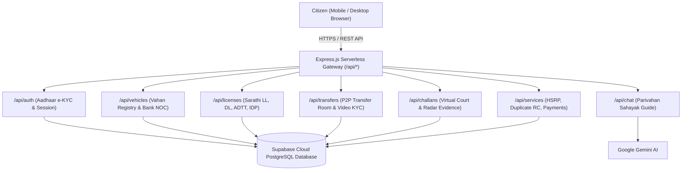

# Parivahan Sewa — Reimagined 🇮🇳
> **Unified Faceless Transport & Citizen Mobility Portal**  
> *A digital-first, faceless government services architecture eliminating physical RTO visits across India.*

[](https://parivahan-reimagined.vercel.app)
[](https://supabase.com)
[](https://expressjs.com)

---

## 🌐 Live Product Demo
🔗 **Live Application**: [https://parivahan-reimagined.vercel.app](https://parivahan-reimagined.vercel.app)  
📡 **API Health Endpoint**: [https://parivahan-reimagined.vercel.app/api/health](https://parivahan-reimagined.vercel.app/api/health)

---

## 💡 Executive Summary & Problem Statement

### The Citizen Problem
Every year, over 120 million Indian citizens interact with regional transport offices (RTOs) for vehicle registrations, ownership transfers, and driving licenses. The legacy experience suffers from:
1. **Physical Coordination Friction in P2P Vehicle Sales**: When a buyer and seller live in different cities, obtaining physical signatures, Form 29/30 physical submissions, and bank hypothecation NOCs often takes 6+ months and mandatory RTO agent visits.
2. **Opaque Traffic Challan Adjudication**: Citizens receive fines without contextual evidence and are forced to visit traffic courts to dispute incorrect radar hits.
3. **Fragmented Licensing Journey**: Disconnected steps across Learner's Licenses (LL), Automated Driving Test Tracks (ADTT), and International Driving Permits (IDP).

### The Solution: Parivahan Reimagined
A unified, state-aware citizen platform designed around **faceless e-governance principles** (MVA 2019 & CMVR):
- **Remote Bilateral P2P Ownership Transfer**: Synchronized transfer room with live WebRTC Remote Video KYC, verbal OTP consent, and automated bank loan Account Aggregator NOC clearance.
- **End-to-End Citizen Lifecycle**: Progression from Aadhaar-authenticated Learner's License $\rightarrow$ Automated Driving Test Track (ADTT) slot reservation $\rightarrow$ Physical Speed Post dispatch $\rightarrow$ 4-Vehicle Fleet management.
- **Virtual Traffic Court & Challan Radar Evidence**: Photographic speed radar violations with 1-click statutory dispute filing and frozen payment deadlines.
- **6-Step International Driving Permit (IDP)**: Tele-consultation integration with e-Sanjeevani (Form 1-A medical fitness) and blood serology lab report verification.

---

## 🏛️ System Architecture



---

## 🗄️ Relational Data Model (`database/schema.sql`)

| Table | Description | Key Attributes |
| :--- | :--- | :--- |
| `citizens` | Citizen identities & demographics | `id (UUID)`, `role_key`, `name`, `aadhaar`, `mobile`, `address`, `state`, `blood_group` |
| `vehicles` | National Vahan vehicle registry | `id`, `owner_id`, `reg_number`, `model_name`, `puc_status`, `hypothecated_to`, `noc_cleared` |
| `licenses` | Sarathi licensing records | `id`, `citizen_id`, `license_type (LL/DL)`, `status`, `slot_date`, `speed_post_tracking` |
| `transfers` | P2P ownership transfer room | `id`, `vehicle_id`, `seller_id`, `buyer_id`, `status`, `seller_kyc`, `buyer_kyc`, `submitted` |
| `challans` | Virtual Traffic Court citations | `id`, `vehicle_id`, `reg_number`, `location`, `speed_record`, `amount`, `status (unpaid/disputed/paid)` |
| `payments` | Bharat BillPay (BBPS) ledger | `id`, `citizen_role_key`, `title`, `amount`, `bbps_ref`, `payment_date` |
| `idp_applications` | Geneva Convention 1949 IDP | `id`, `app_number`, `passport_number`, `doctor_approved`, `blood_report_uploaded`, `is_draft` |

---

## 🚀 Key Workflows

### 1. Collaborative Peer-to-Peer Ownership Transfer
1. **Pre-Flight Readiness Check**: Automated real-time validation of bank hypothecation liens and traffic challans.
2. **1-Click Digital Bank NOC**: Connects via Account Aggregator API to HDFC Bank to verify loan closure and clear the lien in VAHAN.
3. **Buyer Digital Invite**: Seller generates a secure 48-hour invite directly into the buyer's private dashboard.
4. **Remote Video KYC & Verbal OTP**: Both parties perform a 4-step guided liveness check with verbal code recitation (`8 2 4 9 1`) recorded for non-repudiation.

### 2. Complete Driver Lifecycle
1. **Learner's License**: Aadhaar e-KYC $\rightarrow$ 1-click DigiLocker age/address proof fetch $\rightarrow$ Digital signature $\rightarrow$ AI proctored road safety test $\rightarrow$ Digital LL issuance.
2. **Permanent DL**: CMVR 30-day practice window check $\rightarrow$ ADTT sensor track appointment slot picker $\rightarrow$ RTO sign-off simulation $\rightarrow$ Speed Post physical smart card tracker.
3. **Vehicle Fleet**: Transitions into a 4-vehicle management hub with live PUC renewal alerts and e-Challan payments.

---

## 📁 Repository Structure

```
parivahan-reimagined/
├── index.html                   # Single-Page Citizen Application UI
├── vercel.json                  # Serverless function routing & static rewrites
├── package.json                 # Node dependencies & test scripts
├── .env.example                 # Environment variables configuration template
│
├── api/
│   └── index.js                 # Vercel serverless entry point
│
├── server/
│   ├── server.js                # Express app entry & static middleware
│   ├── db/
│   │   └── supabase.js          # Cloud Supabase connection & fallback memory engine
│   └── routes/
│       ├── auth.js              # /api/auth (Aadhaar OTP & Sessions)
│       ├── vehicles.js          # /api/vehicles (Vahan Registry & Bank NOC)
│       ├── licenses.js          # /api/licenses (Sarathi LL/DL/ADTT/IDP)
│       ├── transfers.js         # /api/transfers (P2P Transfer Room & KYC)
│       ├── challans.js          # /api/challans (Virtual Court & Radar Evidence)
│       ├── services.js          # /api/services (HSRP, Duplicate RC, Payments)
│       └── chat.js              # /api/chat (Parivahan Sahayak AI Proxy)
│
├── database/
│   └── schema.sql               # PostgreSQL migration script for Supabase
│
└── tests/
    ├── portal_audit.test.js     # End-to-end full citizen workflow audit (55 assertions)
    └── api.test.js              # Backend REST API integration test suite (13 endpoints)
```

---

## 💻 Local Development Setup

### Prerequisites
- Node.js (v18 or higher)
- npm

### Installation & Run
```bash
# 1. Clone repository
git clone https://github.com/satyapay/parivahan-reimagined.git
cd parivahan-reimagined

# 2. Install dependencies
npm install

# 3. (Optional) Configure Supabase in .env
cp .env.example .env

# 4. Start local development server
npm start
```
Server runs at `http://localhost:3000`.

### Running Automated Test Suite
```bash
# Run full portal end-to-end workflow audit
npm test

# Run backend REST API test suite
npm run test:api
```

---

## 🛡️ License
This project is open-source under the [MIT License](LICENSE).
